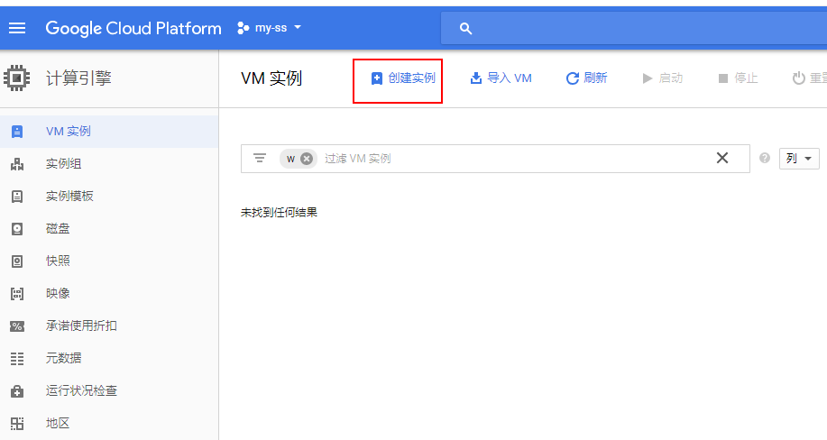

## 1.试用gcp

```
准备visa卡,点击免费试用
```

## 2.新建防火墙

VPC网络 –> 防火墙规则–> 新建防火墙规则 –>指定的协议和端口："tcp:你的端口号"


## 3.创建VM实例

1. 地区：可以选择亚洲的节点；

2. 机器类型：选择最低配的，微型。

3. 启动磁盘：我选了CentOS7的操作系统

4. 网络：记得新建静态IP地址，后面需要绑定到实例。





## 3.保留静态ip并绑定

网络 –> 绑定外部IP地址 –> 保留静态地址 （未附加到实例或负载平衡器的静态 IP 地址将按小时计费!!!）


## 4.开始配置ss

1). 用 Google Cloud 有自带的SSH工具, 链接上服务器。


链接完毕后显示如下


2). 输入命令 sudo -i 获取root权限

3). 输入 yum install -y emacs python python-pip 安装 Emacs 编辑器和 Python (编辑器用于编辑SS的配置文件，Python用于运行SS)。


4). 等待一会儿后安装完毕，输入命令 pip install shadowsocks 安装SS;

5). 输入命令emacs /etc/ss.json 打开编辑器，并打开一个名为ss.json的配置文件保存在/etc/目录下


以下是SS官方的默认配置：

```
    {
        "server":"100.245.485.24", //你服务器静态IP地址
        "server_port":8088, //端口号
        "password":"12345", //密码
        "timeout":600,
        "method":"rc4-md5", 
        "auth": true
    }
```


配置完成后, 按ctrl + x 然后 ctrl + s 保存文件，再按 ctrl + x然后 ctrl + c退出编辑器。

6). 最后输入命令 ssserver -c /etc/ss.json -d start 即可启动 Shadowsocks 服务器。

```
要停止SS服务器（例如需要更改配置文件），输入ssserver -d stop即可。

要让SS服务能在后台运行，输入 ssserver -p 你的端口号 -k 你的密码 -m rc4-md5 --user nobody -d start 
```
到此为止，服务器端的配置已经搞定。


## 5.开始使用


***Peace***

