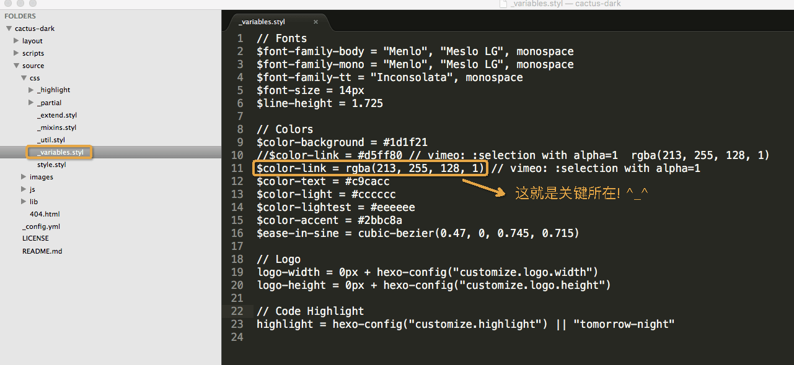

* 看了好多 hexo 主题, `next` 太多人用... 只有看 `cactus-dark` 和 `solar` 还蛮舒服. 最后选择了 `cactus-dark`, 不过! `cactus-dark` 和 `solar` 链接划线的颜色是红色! 什么情况! 红配绿, 简直不能忍! 不过,我是 `Android` 开发, OMG.. 只好硬着头皮找代码!

* 终于, 还是让我找到了.

* 就在 --- `~/themes/cactus-dark/source/css/_variables.styl` 中 

* 呼哈哈

**配张图 把神秘的代码展示出来**

以上就是我对 hexo 主题(cactus-dark)的小修改, 换个颜色看起来了好多了, (＾－＾)V

***Peace***

